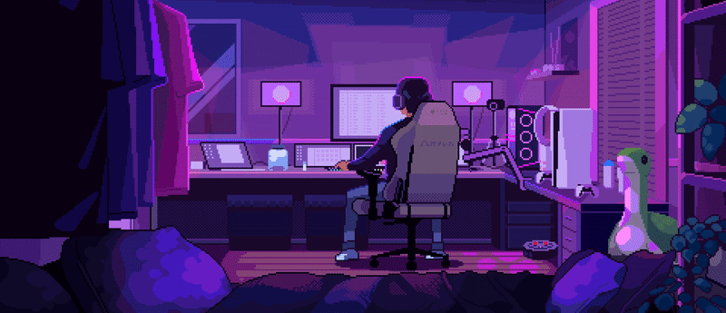

<h1 align="center">Hi 👋, I'm Stepanov Igor</h1>
<h3 align="center">A passionate Frontend Developer</h3>

- 🔭 I’m currently looking for **job and new suggestions**

- 👨‍💻 All of my projects are available at [https://next-js-stpkkk-portfolio-git-ru-igorstepanov.vercel.app/](https://next-js-stpkkk-portfolio-git-ru-igorstepanov.vercel.app/)

- 📫 How to reach me **stipyk1309@gmail.com**

- ⚡ Fun fact: **Ride a bicycle 6,000 kilometers in one year**

<h3 align="left">Connect with me:</h3>

<h3 align="left">Languages and Tools:</h3>

  

 
<a href="https://nextjs.org/" target="_blank" rel="noreferrer"> 
 
 

 

 
 

 
 

 

&nbsp;

  

